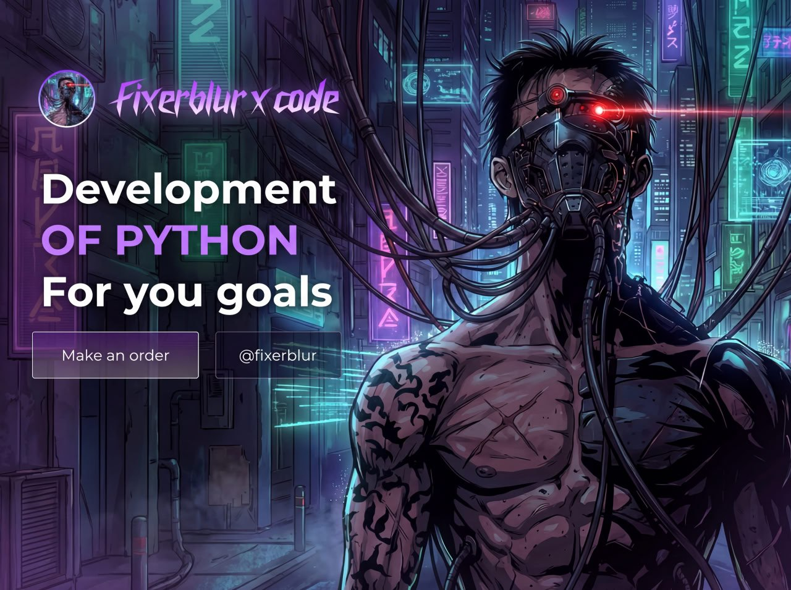

 

## About me

Python developer. I write tools that take repetitive work off people's hands: collecting data from websites, processing files, running bots.

**What I build**

- Scrapers and crawlers that pull structured data from websites and export it to Excel, CSV or JSON
- Command-line tools for downloading video, converting files and generating QR codes
- Desktop utilities that run speech-to-text and image inpainting offline, without cloud services
- Telegram bots and small web applications

 

## Tech stack

  

 

## How I learned

- 📖 *Python Crash Course* — Eric Matthes
- 🌐 W3Schools & Sololearn courses
- 🎓 Cisco Networking Academy — Python Essentials
- 🐍 The official Python docs
- ♟️ Practice on CodeWars, LeetCode and CheckiO
- 🎥 And, of course, many, many hours of YouTube tutorials

 

## Get in touch

  

Thanks for stopping by.

